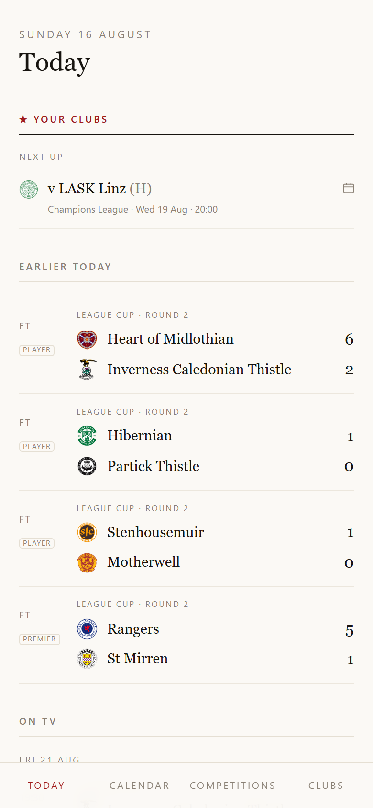
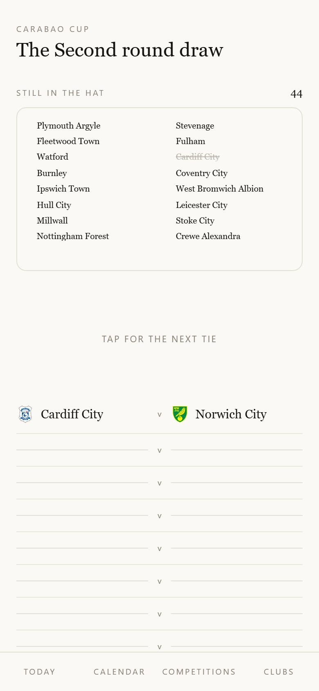
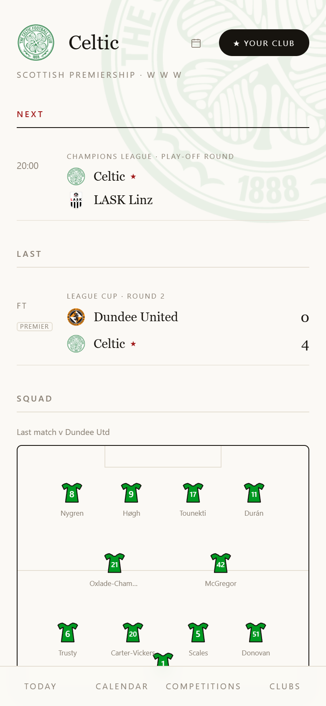
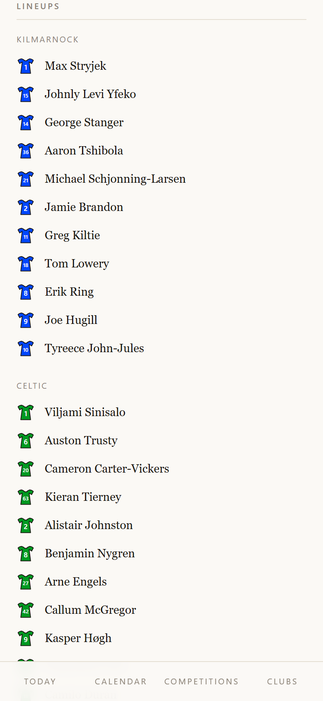
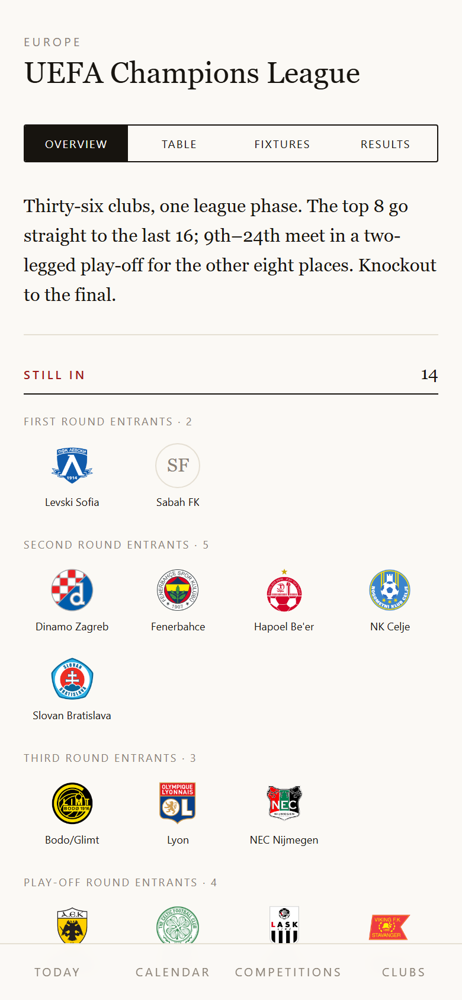
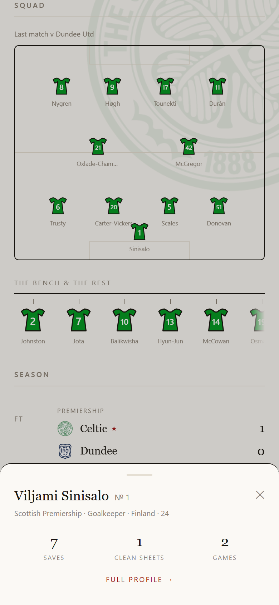

# MazzaDailyFootball

A personal, ad-free football paper. All the Scottish leagues, the English Premier League, every
cup they feed into, and the three European competitions — set like a broadsheet: serif headlines,
hairline rules, and room to breathe. No ads, no accounts, no tracking, and nothing to pay for.

Built for one Celtic fan's morning read; shared in case it's yours too.

| The day's paper | The draw, in your hands | The team sheet |
|---|---|---|
|  |  |  |

| The match room | The competition, in a sentence | The player, one tap deep |
|---|---|---|
|  |  |  |

## What it does

- **Today** — live scores, the day's fixtures and last night's results across every followed
  competition, your clubs' next matches, what's on TV tonight, and quick league tables.
- **Draw ceremonies** — when a cup round is drawn, the app doesn't just list it: the clubs go
  into a bowl and *you* tap the balls out, pairing by pairing. Never autoplayed, never spoiled —
  the bowl is shuffled so it can't telegraph who's drawn together.
- **Cup field boards** — who's still in, who's out and when they fell, who enters at which round,
  each competition's shape written as a line of prose.
- **Team pages** — last match's XI laid out on a pitch in club-coloured shirts, the rest of the
  squad hanging on a rail, the club crest watermarking the page.
- **Match rooms** — lineups in club colours, goals and cards with names, head-to-head history,
  form, standout players, and contextual YouTube highlights after full time.
- **Fixture drawers** — tap any result and it unfolds in place: a goal timeline across the
  ninety minutes, scorers by side, attendance. Tap an upcoming fixture for recent meetings and
  a head-to-head balance bar in club colours.
- **The papers** — the top Celtic story and the top British football story from BBC Sport,
  each expandable to five, right on the Today page.
- **The scout** — tap any European opponent and the app finds their domestic league, their
  squad, their recent record, and a highlights reel — automatically, for any club.
- **Player sheets** — tap any player anywhere and their card slides up in place; swipe up for the
  full profile, swipe down and you're exactly where you were.
- **Calendars** — a general fixture calendar plus one per club, and TV badges (Sky, TNT, BBC,
  Premier Sports…) on every listed broadcast.

## Running it yourself

You need Node 20+.

```bash
git clone https://github.com/magicmazuk/MazzaDailyFootball.git
cd MazzaDailyFootball
npm install
npm run dev        # → http://localhost:5173
```

That's the whole install. The dev server serves the two data proxies locally, so the app is fully
live-data from the first run.

**Optional — YouTube highlights:** create `.env.local` with
`VITE_YOUTUBE_API_KEY=<your key>` (a free [YouTube Data API v3](https://developers.google.com/youtube/v3/getting-started)
key). Without it the app simply doesn't show the highlights card. Everything else is keyless.
Because a Vite `VITE_` key ships in the client bundle, restrict it in Google Cloud Console:
API restrictions → YouTube Data API v3 only, plus HTTP-referrer restrictions for your domains.

**Deploying:** the repo deploys to [Vercel](https://vercel.com) as-is (`vercel.json` included) —
import the repo, optionally add `VITE_YOUTUBE_API_KEY` as an environment variable, done. The two
serverless proxies keep the feeds cached at the edge, so the free tier is plenty.

**Making it yours:** Celtic is the permanently followed club (that's the "personal" part —
change `CELTIC` in `src/store/prefs.js` or just follow your own clubs in the app; favourites are
prioritised, never exclusive). TV listings are a hand-curated file at
`src/data/tvListings.json` — broadcast data has no free feed, so it's maintained by hand and the
app never invents a listing.

```bash
npm run test:run   # the suite (700+ tests)
npm run build      # production build
```

## How it's free

Fixtures, results, tables, squads and player statistics come from publicly accessible ESPN and
BBC endpoints, fetched through two small serverless proxies with edge caching and a
last-known-good fallback (the app tells you when it's showing stale data rather than showing
nothing). This is an unofficial personal project — it isn't affiliated with or endorsed by ESPN,
the BBC, or any league or club, and the crests belong to their clubs.
